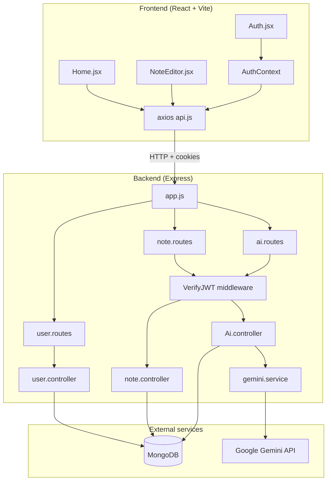

# noteAi

A full-stack note-taking app with AI-assisted titles and summaries. Write in a distraction-free editor, organize notes with tags, and let Google Gemini suggest a title when you leave a note or generate a summary on demand.

---

## What it does

- **Authentication** — Register and sign in with email/password. Sessions use JWTs stored in HTTP-only cookies.
- **Notes dashboard** — View all notes in a card grid, filter by tag, and create or delete notes.
- **Rich editor** — Auto-save note content as you type (debounced). Edit title and tags in a modal.
- **AI title generation** — When you navigate back from the editor, Gemini can generate a short title from your content. User-edited titles are never overwritten.
- **AI summaries** — Generate a 2–3 sentence preview from note content for the home screen cards.
- **Tag organization** — Add comma-separated tags; filter the dashboard by tag with color-coded chips.

---

## Architecture

The project is a **monorepo** with a React SPA frontend and a Node.js REST API backend, both talking to **MongoDB** for persistence and **Google Gemini** for AI features.



### Request flow (high level)

1. **Auth** — Login sets `accessToken` and `refreshToken` cookies. Protected routes read the access token from cookies (or `Authorization: Bearer`).
2. **Notes** — Each user document holds an array of note ObjectIds. Creating a note pushes its id onto the user; listing notes populates that array.
3. **Content saves** — The editor PATCHes content on a debounce timer and flushes pending saves before AI calls.
4. **AI** — Title and summary endpoints validate ownership, then call `gemini.service.js`, which truncates long content and normalizes Gemini output.

### Title generation logic

`titleGenerator` on each note tracks who “owns” the title:

| Value   | Meaning                                      |
|---------|----------------------------------------------|
| `none`  | Default; AI may generate a title             |
| `ai`    | Title was set by Gemini                      |
| `human` | User edited the title; AI must not overwrite |

**Frontend (`NoteEditor.jsx`)**

- Local `titleGenerator` state is initialized from the loaded note.
- Manual title edit in the modal → PATCH with `titleGenerator: "human"` and update local state.
- On **Back**: skip the AI call if state is `"human"` or content is empty; otherwise POST to `/ai/title` with `{ content, titleGenerator }`.
- Update the displayed title only when the API returns a non-empty `title`.

**Backend (`Ai.controller.js`)**

- Reads `note.titleGenerator` from the database (source of truth).
- If `"human"` → respond with `{ title: "", note }` (no generation).
- If `"ai"` or `"none"` → call Gemini; on success, persist title and set `titleGenerator: "ai"`.
- Empty or `"Untitled"` model output → return empty title without updating.

---

## Tech stack

| Layer      | Technologies |
|-----------|--------------|
| Frontend  | React 19, React Router 7, Vite 8, Tailwind CSS 4, Axios, Lucide icons |
| Backend   | Node.js, Express 5, Mongoose 9 |
| Auth      | JWT (access + refresh), bcrypt, cookie-parser |
| Database  | MongoDB |
| AI        | `@google/generative-ai` (default model: `gemini-2.5-flash`) |
| Security  | Helmet, CORS (credentials), HTTP-only cookies |

---

## Project structure

```
AiNotes/
├── backend/
│   └── src/
│       ├── index.js              # Entry: env, DB connect, listen
│       ├── app.js                # Express app, middleware, route mounting
│       ├── db/dbconnect.js         # MongoDB connection
│       ├── models/
│       │   ├── user.model.js     # User + password hash + JWT helpers
│       │   └── note.model.js     # Note schema
│       ├── controllers/
│       │   ├── user.controller.js
│       │   ├── note.controller.js
│       │   └── Ai.controller.js
│       ├── routes/
│       │   ├── user.routes.js
│       │   ├── note.routes.js
│       │   └── ai.routes.js
│       ├── middleware/auth.middleware.js
│       ├── services/gemini.service.js
│       └── utils/                # ApiError, ApiResponse, asyncHandler, errorHandler
│
└── frontend/
    └── src/
        ├── main.jsx
        ├── App.jsx               # Routes + protected/public guards
        ├── AuthContext.jsx       # Login, register, logout, user persistence
        ├── api.js                # Axios instance (base URL + credentials)
        └── pages/
            ├── Auth.jsx
            ├── Home.jsx
            └── NoteEditor.jsx
```

---

## Data models

### User

- `name`, `email`, `password` (hashed on save)
- `notes[]` — references to `Note` documents
- `refreshToken` — stored for session refresh flow

### Note

- `title` — default `"Untitled"`
- `content` — markdown/plain text body
- `tags[]` — string array
- `summary` — AI-generated preview text
- `titleGenerator` — `"human"` | `"ai"` | `"none"`
- `createdAt`, `updatedAt` — timestamps

---

## API reference

Base URL: `http://localhost:8000/api/v1`

All note and AI routes require authentication (`VerifyJWT`).

### Users

| Method | Endpoint            | Description        |
|--------|---------------------|--------------------|
| POST   | `/users/register`   | Create account     |
| POST   | `/users/login`      | Login (sets cookies) |
| GET    | `/users/notes`      | List user's notes (populated) |

### Notes

| Method | Endpoint                  | Description                    |
|--------|---------------------------|--------------------------------|
| POST   | `/notes/`                 | Create note (`titleGenerator: "ai"`) |
| PATCH  | `/notes/:noteId/content`  | Update content                 |
| PATCH  | `/notes/:noteId`          | Update title, tags, `titleGenerator` |
| DELETE | `/notes/:noteId`          | Delete note                    |

### AI

| Method | Endpoint                      | Body              | Description              |
|--------|-------------------------------|-------------------|--------------------------|
| POST   | `/notes/:noteId/ai/title`     | `{ content }`     | Generate title (respects `titleGenerator`) |
| POST   | `/notes/:noteId/ai/summary`   | `{ content }`     | Generate and save summary |

Responses use a consistent shape via `ApiResponse`:

```json
{
  "statusCode": 200,
  "data": { },
  "message": "Success message",
  "success": true
}
```

---

## Getting started

### Prerequisites

- [Node.js](https://nodejs.org/) 18+
- [MongoDB](https://www.mongodb.com/) (local or Atlas)
- [Google AI Studio](https://aistudio.google.com/) API key for Gemini

### 1. Clone and install

```bash
git clone <repository-url>
cd AiNotes

cd backend && npm install
cd ../frontend && npm install
```

### 2. Backend environment

Create `backend/.env`:

```env
PORT=8000
MONGODB_URI=mongodb://127.0.0.1:27017/ainotes

ACCESS_TOKEN_SECRET=your_access_secret
ACCESS_TOKEN_EXPIRY=1d
REFRESH_TOKEN_SECRET=your_refresh_secret
REFRESH_TOKEN_EXPIRY=7d

GEMINI_API_KEY=your_gemini_api_key
GEMINI_MODEL=gemini-2.5-flash

NODE_ENV=development
```

Use strong random strings for JWT secrets in production.

### 3. Run the app

**Terminal 1 — API**

```bash
cd backend
npm run dev
```

**Terminal 2 — Frontend**

```bash
cd frontend
npm run dev
```

Open [http://localhost:5173](http://localhost:5173). The frontend expects the API at `http://localhost:8000/api/v1` (see `frontend/src/api.js`).

### Production build (frontend)

```bash
cd frontend
npm run build
npm run preview
```

Update CORS `origin` in `backend/src/app.js` and the Axios `baseURL` when deploying.

---

## Frontend routes

| Path           | Page          | Access    |
|----------------|---------------|-----------|
| `/auth`        | Login/register| Public only |
| `/`            | Notes home    | Protected |
| `/notes/:id`   | Note editor   | Protected |

---

## Design notes

- **Auto-save** — Content PATCH runs 700ms after the last keystroke; leaving the editor flushes any pending save before AI requests.
- **Home refresh** — After a successful AI title on back navigation, `sessionStorage` flags a list refresh (pattern used for keeping the dashboard in sync).
- **Error handling** — Central `errorHandler` middleware maps `ApiError` instances to JSON responses.
- **Content limits** — Request body limit 16kb; Gemini input truncated to 8000 characters in the service layer.

---

## License

ISC (backend package). Add a root license file if you plan to open-source the full repo.
